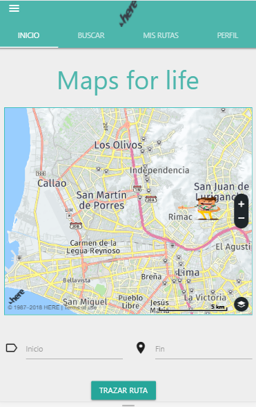

## Here Maps
# **Descripcion del proyecto:**
  Plataforma que permite a los usuarios trackear y monitorear recorridos que se realice en senderos al aire libre/outdoor, orientada a los amantes de las actividades de aventura (montañas, lagos, parques, etc.) en Perú.

  
# **Integrantes**
* Lilliam Haro
* Melissa Yauri
# **Funcionalidad**
  -
  -  

# **Herramientas utilizadas:**
  - HTML5
  - CSS3
  - Jquery
  - Bootstrap

[RECURSOS](assets/images/...)
