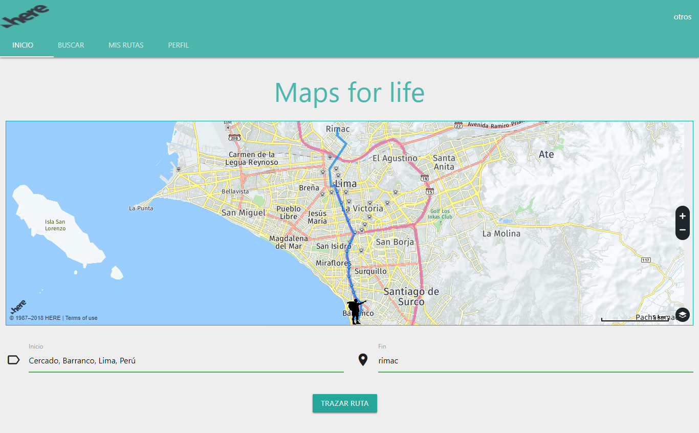
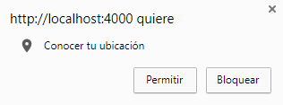
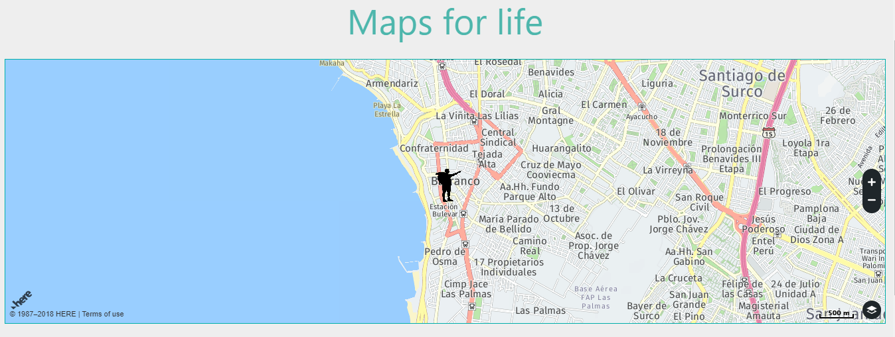
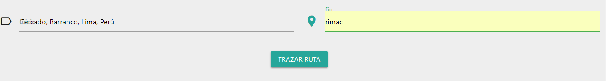
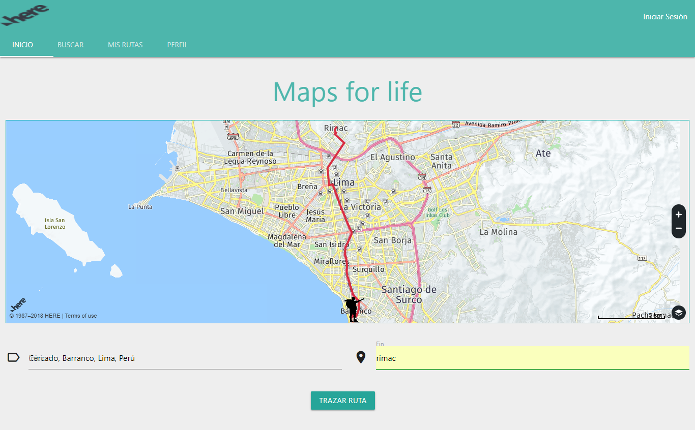

# Here Maps
  Plataforma que permite a los usuarios trazar recorridos al destino que el usuario lo solicite.Asimismo la plataforma está orientada a los amantes de las actividades de aventura (montañas, lagos, parques, etc.) en Perú.

  

## Integrantes
* Lilliam Haro
* Melissa Yauri

## Flujo
1. Determina la ubicación del usuario.

  

2. La ubicación del usuario se muestra mediante un marcador en el mapa.

   

3. Luego el usuario puede trazar la ruta hacia el destino que lo requiera.El punto de inicio es la ubicación del usuario y el punto de partida depende de lo que ingrese el usuario.

   

   

4. Y también en la sección buscar, el usuario puede encontrar lugares cercanos como resturantes, hoteles, etc. En ello el usuario encuentra información como el nombre del resturant y la dirección.

   

## Herramientas utilizadas:
  - HTML5
  - CSS3
  - Jquery
  - Materialize
  - Here-Maps api

## Recursos

  * [Here-maps](https://developer.here.com/documentation)
  * [Materialize](http://materializecss.com/)
